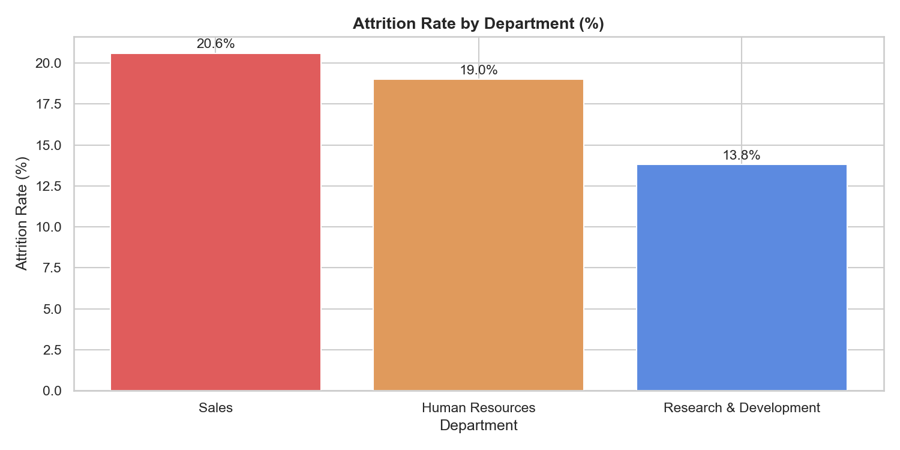
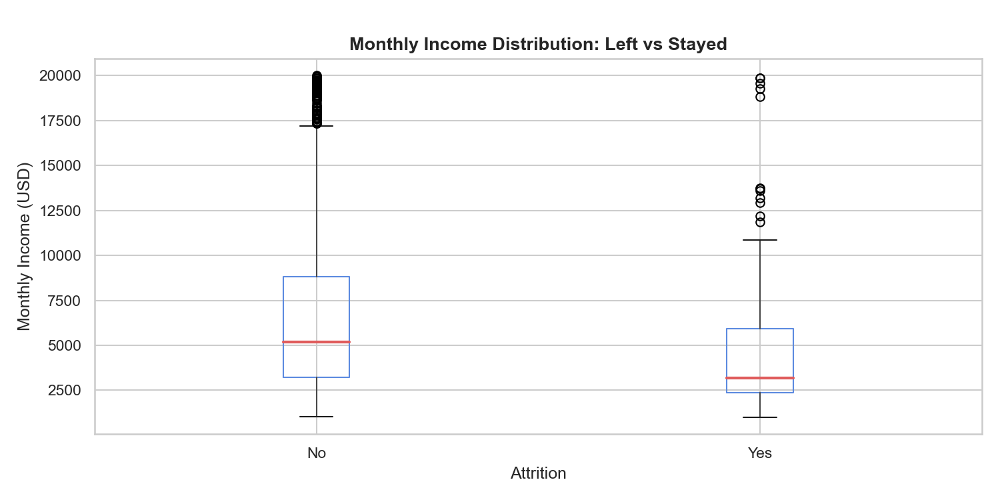
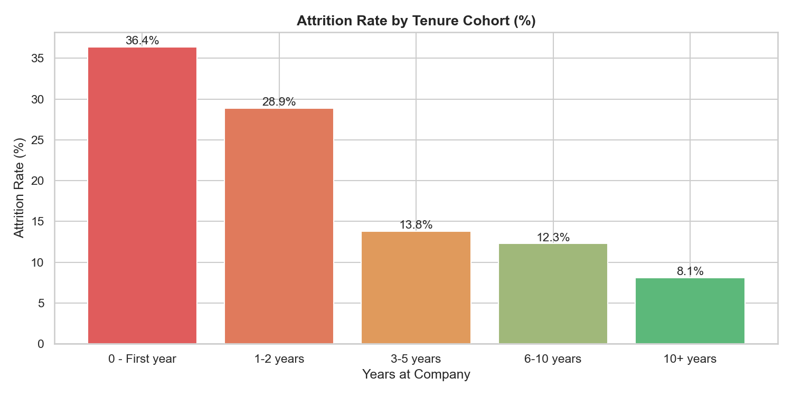
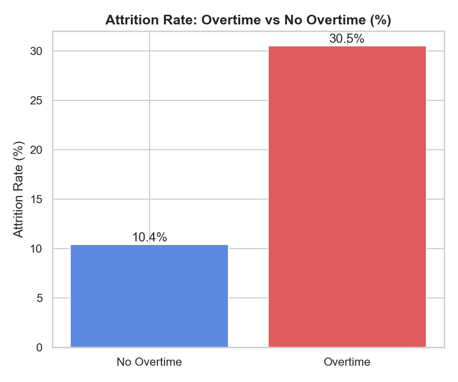

# Análise de Rotatividade de Colaboradores (HR Attrition)

Análise exploratória dos padrões de rotatividade de uma empresa fictícia usando o dataset IBM HR Analytics.
O objetivo é identificar quais fatores mais influenciam o turnover e sinalizar colaboradores ativos com risco de saída.

---

## Pergunta central

**O que leva um colaborador a pedir demissão — e quem tem mais chance de sair?**

---

## Dataset

- **Fonte:** [IBM HR Analytics Employee Attrition & Performance](https://www.kaggle.com/datasets/pavansubhasht/ibm-hr-analytics-attrition-dataset) via Kaggle
- **Tamanho:** 1.470 colaboradores | 35 variáveis
- **Valores nulos:** 0

---

## Metodologia

1. **SQL** — agregações, CTEs, window functions e análise de coorte no SSMS (SQL Server)
2. **Python** — limpeza de dados, EDA e análise segmentada com pandas, matplotlib e seaborn
3. **Score de risco** — modelo baseado em regras para identificar colaboradores ativos com múltiplos fatores de risco simultâneos

---

## Principais achados

- Taxa de attrition geral: **16,1%**
- Sales foi o departamento com maior taxa de attrition: **20,6%**
- Colaboradores no **primeiro ano** tiveram taxa de 36,4% — mais de 4x maior que os com 10+ anos de empresa (8,1%)
- Colaboradores com horas extras têm **3x mais chance de sair**: 30,5% vs 10,4%
- Salário médio de quem saiu: **$4.787** vs **$6.833** de quem ficou — diferença de 30%
- **336 colaboradores ativos (27,3%)** foram sinalizados como alto risco com base em fatores combinados: horas extras + salário abaixo da mediana do departamento + baixa satisfação com o trabalho

---

## Visualizações

### Taxa de Attrition por Departamento


### Salário Mensal: Saiu vs Ficou


### Taxa de Attrition por Tempo de Empresa


### Taxa de Attrition: Com vs Sem Horas Extras


---

## Estrutura do repositório

```
hr-attrition-analysis/
├── data/
│   └── WA_Fn-UseC_-HR-Employee-Attrition.csv
├── images/
│   ├── attrition_by_department.png
│   ├── attrition_by_tenure.png
│   ├── attrition_overtime.png
│   └── income_vs_attrition.png
├── notebooks/
│   └── attrition_analysis.py
├── sql/
│   └── attrition_queries_v2.sql
├── README.md
└── README_PT.md
```

---

## Tecnologias utilizadas


---

## Como executar

```bash
git clone https://github.com/maggabrielle/hr-attrition-analysis.git
cd hr-attrition-analysis
pip install pandas matplotlib seaborn
python notebooks/attrition_analysis.py
```

> As queries SQL em `sql/attrition_queries_v2.sql` foram escritas e testadas no SQL Server (SSMS).
> A sintaxe é compatível com SQL Server e pode ser adaptada para PostgreSQL ou BigQuery com ajustes mínimos.
